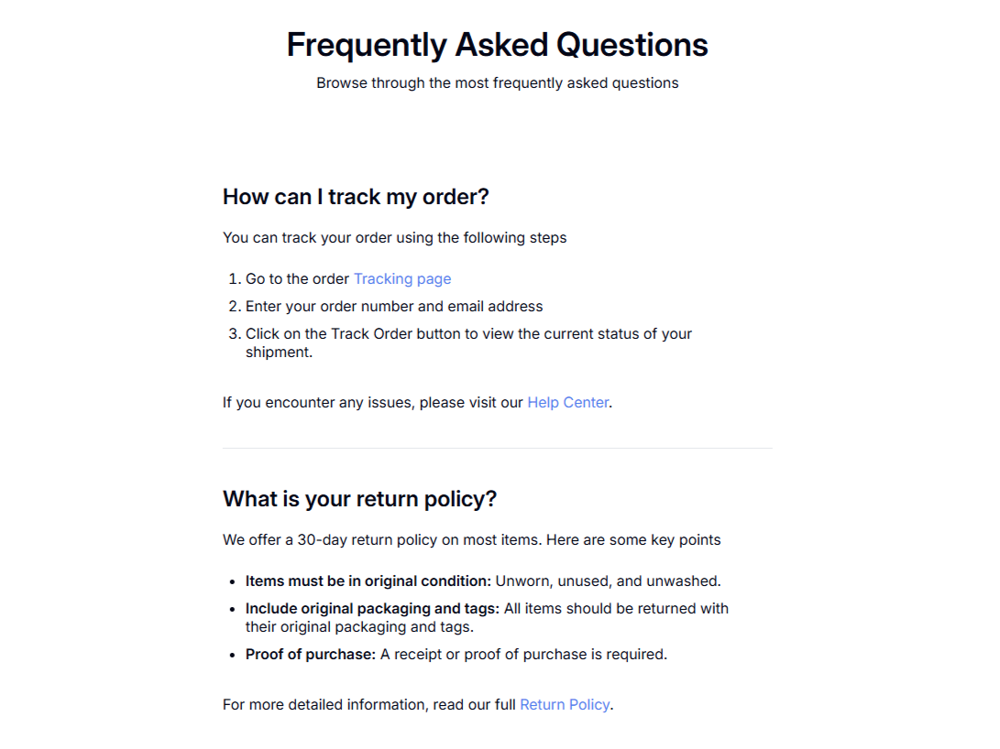

<h1 align="center">FAQ Página Simples</h1>

## Overview
Este projeto é um desafio do site DevChallenges. O desafio tinha como objetivo criar uma página simples de FAQ (Frequently Asked Questions) utilizando apenas HTML e CSS.

### O que foi utilizado nesse projeto

- HTML5
- CSS
- Flexbox
- Google Fonts

### Features

- Layout responsivo com Flexbox
- Design clean e minimalista

### Dev

- [LinkedIn](https://www.linkedin.com/in/eliezer-vencato/)
- [Github](https://github.com/eliezervencato)
